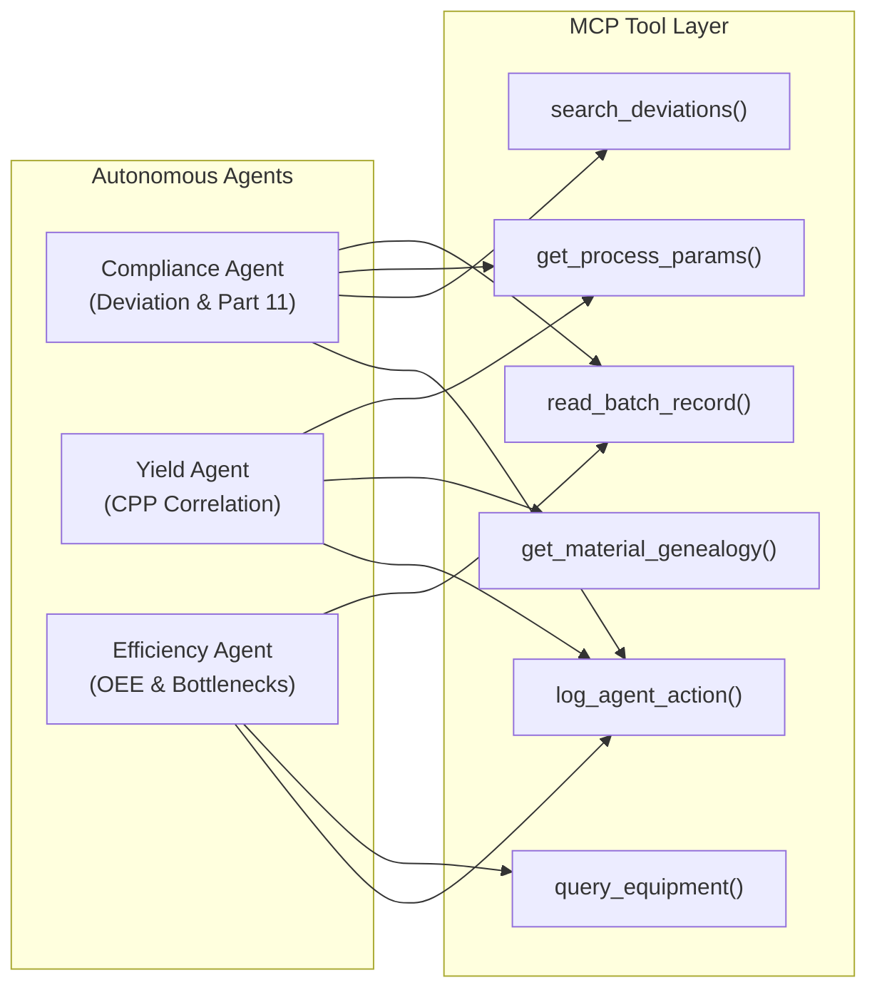

# PVA Systems VPU-50 SCADA / MES Platform

[](https://www.qt.io/)
[](https://www.python.org/)
[](https://www.fda.gov/)
[](https://www.isa.org/)
[](https://ispe.org/)
[-003B57?logo=sqlite&logoColor=white)](https://www.sqlite.org/)
[-success)](https://github.com/)

> **Industrial-grade Manufacturing Execution System (MES) and Supervisory Control & Data Acquisition (SCADA) platform for the PVA Systems VPU-50 Vacuum Homogenizer & Emulsification Skid.**
> 
> Engineered for regulated pharmaceutical, cosmetic, and specialty chemical manufacturing in compliance with **FDA 21 CFR Part 11, EU Annex 11, ALCOA+ Data Integrity, and ISA-88 Batch Control standards**.

---

## 📑 Table of Contents
- [Executive Overview](#-executive-overview)
- [Architecture & Core Pillars](#-architecture--core-pillars)
- [Comparison: Leucine MES vs PVA VPU-50](#-comparison-leucine-mes-vs-pva-vpu-50)
- [Screens & Operable Modules](#-screens--operable-modules)
- [Cortex AI & Model Context Protocol (MCP)](#-cortex-ai--model-context-protocol-mcp)
- [View vs Controller Architecture (.ui.qml vs .qml)](#-view-vs-controller-architecture-uiqml-vs-qml)
- [Shop-Floor L2 Edge Connectivity](#-shop-floor-l2-edge-connectivity)
- [Mass Deployment Guide (1,000s of Machines)](#-mass-deployment-guide-1000s-of-machines)
- [Getting Started & Local Execution](#-getting-started--local-execution)
- [Testing & Quality Assurance](#-testing--quality-assurance)

---

## 🌟 Executive Overview

The **PVA VPU-50 SCADA / MES** bridges real-time shop-floor skid automation (PLCs, motors, vacuum pumps, thermal regulation) with enterprise-grade batch recipe management, cryptographic audit logging, and AI-driven compliance intelligence.

```
                    ┌────────────────────────────────────────────────────────┐
                    │               ERP Layer (SAP / Oracle)                 │
                    │   Process Orders, BOM Specifications, Material Lots    │
                    └───────────────────────────┬────────────────────────────┘
                                                │ REST / JSON
                                                ▼
┌────────────────────────────────────────────────────────────────────────────────────────────┐
│                              PVA VPU-50 SCADA / MES PLATFORM                              │
├────────────────────────────────┬───────────────────────────┬──────────────────────────────┤
│    ISA-88 Recipe Authoring     │   Real-Time Cockpit & P&ID│      Cortex AI & Review      │
│  • No-Code Stage → Task Flow   │ • 6 Process Control Rows  │  • Compliance Agent (Part 11)│
│  • SAP-Style BOM Formulation   │ • Vector P&ID Synoptic    │  • Yield Prediction Agent    │
│  • Equipment State Interlocks  │ • Multi-Pen Realtime Trend│  • OEE & Bottleneck Agent    │
│  • Multi-Role Governance       │ • Fast Alarm Annunciator  │  • Standardized MCP Tools    │
├────────────────────────────────┴───────────────────────────┴──────────────────────────────┤
│                         21 CFR Part 11 Cryptographic Audit Trail                           │
│                 SHA-256 HMAC Hash Chains · Immutable Batch Run Snapshots                   │
└───────────────────────────────────────────────┬────────────────────────────────────────────┘
                                                │
                                                ▼
┌────────────────────────────────────────────────────────────────────────────────────────────┐
│                           L2 Edge Gateways & Shop-Floor Hardware                           │
│   • Siemens S7 PLC (1M1501 Agitator, 1X1001 Homogenizer, 1M2001 Pump, 1M3001 Vacuum)      │
│   • Endress+Hauser Flow · RTD Pt100 Temp · Mettler Toledo Balances · Zebra Scanners        │
└────────────────────────────────────────────────────────────────────────────────────────────┘
```

---

## 🏛 Architecture & Core Pillars

### 1. Design & Setup (No-Code MBR Authoring)
* **Master Batch Record (MBR) Builder:** Visual authoring hierarchy (**Stage &rarr; Task &rarr; Device Inspector**).
* **Multi-Role Governance:** Built-in workflow across Author (Incharge), Reviewer, and Approver (Admin) roles.
* **Conditional Interlocks:** Dynamic stop conditions (`temp_reached`, `vacuum_reached`, `vessel_empty`, `time_elapsed`).

### 2. Execution & Compliance (ISA-88 & 21 CFR Part 11)
* **Immutable Batch Snapshots:** Once a batch run starts, the recipe specification is frozen into an immutable historical snapshot.
* **4-Eye Principle:** Dual-signature peer verification in-session without requiring logout.
* **ALCOA+ Audit Trail:** Tamper-evident event logs with cryptographic SHA-256 HMAC verification.

### 3. Materials & Dispensing
* **SAP-Style Phase BOM:** Formulation breakdown across Phases A through F (DI Water, waxes, oils, surfactants, active ingredients).
* **FEFO Pick Lists:** Enforces First-Expired-First-Out material allocation.
* **Point-of-Use Verification:** Barcode scanning and net/tare balance weight validation.

### 4. Monitoring & QA Release (Review by Exception)
* **Review-by-Exception:** In accordance with FDA 2022 CGMP guidance, quality teams inspect flagged Critical Process Parameter (CPP) excursions rather than manual paper review.
* **Electronic Batch Record (eBR):** Instant export of complete batch genealogy, sensor charts, and signed operator comments.

---

## 🔬 Comparison: Leucine MES vs PVA VPU-50

| Leucine MES Capability | PVA VPU-50 SCADA / MES Implementation | Status |
| :--- | :--- | :---: |
| **No-Code MBR Builder** | Screen 9 Recipe Maker (Stage &rarr; Task &rarr; Parameter Inspector) | ✅ Active |
| **SAP / ERP Process Orders** | Automated Recipe Model & JSON/SQLite batch ingestion | ✅ Active |
| **21 CFR Part 11 E-Signatures** | Role-gated Electronic Signatures with mandatory intent comments | ✅ Active |
| **Review-by-Exception** | Cortex Compliance Agent scans time-series for CPP deviations | ✅ Active |
| **Cortex AI Autonomous Agents** | Compliance, Yield Optimization, and Efficiency Agents with MCP tools | ✅ Active |
| **Digital Logbooks & Area Clearance** | Screen 6 Audit Log, CIP verification, equipment calibration tracking | ✅ Active |
| **L2 Shop Floor Connectivity** | Real-time tag catalogue for Siemens S7, Modbus TCP, and OPC UA | ✅ Active |
| **Zero-Setup Mass Deployment** | Embedded SQLite engine (`.db`), AppImage, and MSI packaging | ✅ Active |

---

## 🖥 Screens & Operable Modules

```
[01] Control Dashboard      ─── 6 Industrial process rows (Agitator, Homogenizer, Circulation, Vacuum, Suction, Thermal)
[02] P&ID Synoptic View     ─── Interactive process flow diagram with zoom, pan, fit, and live valve states
[03] Process Trends         ─── Multi-channel historical & real-time canvas spline charting
[04] Alarm Annunciator      ─── High-speed industrial alarm banner with 21 CFR acknowledgment workflows
[05] Recipe Execution (Run) ─── ISA-88 step sequencer, hold point enforcement, and 4-eye verification
[06] Electronic Batch Record─── ALCOA+ audit trail with SHA-256 HMAC hash chain verification
[07] Historical Playback    ─── Time-travel process scrubber for post-mortem batch incident review
[08] Hardware Diagnostics   ─── Physical I/O pinboard override for electrical maintenance
[09] Recipe Maker (Author)  ─── No-code Master Recipe Authoring (Stages, Tasks, Inspector, BOM, Interlocks)
```

---

## 🤖 Cortex AI & Model Context Protocol (MCP)

The built-in **Cortex AI Engine** (`scada/cortex.py`) operates on top of the SCADA state machine and database via standardized **Model Context Protocol (MCP)** tools:



### Supported MCP Tools:
- `read_batch_record(batch_id)`: Extracts full batch genealogy and step executions.
- `get_process_params(batch_id, tag)`: Queries high-resolution sensor telemetry.
- `query_equipment(device_id)`: Inspects calibration status, cleaning records, and run hours.
- `search_deviations(query)`: Scans historical and active quality excursions.
- `get_material_genealogy(batch_id)`: Traces lot numbers, FEFO expiry dates, and supplier certificates.
- `log_agent_action(agent, action, rationale)`: Cryptographically commits agent reasoning into the audit trail.

---

## 🎨 View vs Controller Architecture (`.ui.qml` vs `.qml`)

To guarantee **100% compatibility with Qt Design Studio Form Editor** while maintaining scalable business logic:

1. **`[Name]View.ui.qml` (The View):** Strictly declarative presentation. **0 JavaScript functions / 0 side-effect logic**. Exposes UI items via `property alias`. Supported natively in Qt Design Studio 2D visual editor.
2. **`[Name].qml` (The Controller):** Instantiates the View, attaches `Connections`, interfaces with Python/C++ middleware (`scadaMiddleware`), and executes calculations and audit logging.

```
PVA_VPU50_SCADAContent/
├── Main_frame_screenView.ui.qml        [PURE UI] - Shell frame (Header, Dock, Stack)
├── Main_frame_screen.qml               [CONTROLLER] - Application State, Timers, Alarms
├── screens/
│   ├── Screen_1_Control.ui.qml         [PURE UI] - Process instruments & gauges
│   ├── Screen_2_P_IDView.ui.qml        [PURE UI] - P&ID vector synoptic layout
│   ├── Screen_2_P_ID.qml               [CONTROLLER] - Zoom / Pan / Coordinate math
│   ├── Screen_9_RecipeMakerView.ui.qml [PURE UI] - 3-Column authoring layout
│   └── Screen_9_RecipeMaker.qml        [CONTROLLER] - Recipe save/approve & E-Sign
└── components/widgets/
    └── ScadaNavbar/
        ├── ScadaNavbarItem.ui.qml      [PURE UI] - 96x96 square navigation button
        └── ScadaNavbar.qml             [CONTROLLER] - Scrollable dock container
```

---

## 🔌 Shop-Floor L2 Edge Connectivity

The VPU-50 SCADA engine connects with industrial automation hardware using standard industrial protocols:

| Device Type | Protocol | Tag Prefix | Hardware Asset |
| :--- | :--- | :--- | :--- |
| **Main Agitator Drive** | OPC UA / Modbus TCP | `1M1501` | Lenze / SEW Eurodrive with Anchor Stirrer |
| **Bottom Homogenizer** | OPC UA / Modbus TCP | `1X1001` | High-Shear Rotor-Stator (0–5000 RPM) |
| **Circulation Pump** | Digital I/O / Modbus | `1M2001` | Lobe Positive Displacement Pump |
| **Vacuum Skid** | Modbus TCP / 4-20mA | `1M3001` | Liquid Ring Vacuum Pump (-900 mbar) |
| **Thermal Jacket** | Modbus RTU / Analog | `1E6001` | Proportional Steam & Chilled Water Loop |
| **Dispensary Scale** | Serial RS-232 / TCP | `BAL-01` | Mettler Toledo Precision Balances |
| **Temperature Sensor** | RTD Pt100 (4-Wire) | `1T1001` | Endress+Hauser Sanitary Thermowell |

---

## 🚀 Mass Deployment Guide (1,000s of Machines)

### Zero Database Configuration
Unlike traditional SCADA/MES systems requiring separate MySQL or PostgreSQL server setups:
- **Embedded SQLite Engine:** The entire database layer (`scada_production.db`, `audit.db`, `historian.db`) runs in-process with zero network overhead.
- **Auto-Initialization:** The first time the application runs on a fresh machine, tables, triggers, and calibration parameters are automatically initialized.

### Packaging Options
- **Linux (Industrial Panel PCs / Ubuntu / Debian / RHEL):**
  - Package as a standalone **AppImage** or **Debian `.deb`** package.
- **Windows (Windows 10 / 11 / IoT Enterprise):**
  - Package as an **InnoSetup (`.exe`)** installer or MSI bundle.
- **Web / Edge CDN (Vercel / Cloudflare Pages):**
  - Compile with **Qt 6 WebAssembly (`wasm_singlethread`)** using `scripts/vercel_build.sh`.

---

## 💻 Getting Started & Local Execution

### Prerequisites
- **Python:** 3.11 or higher
- **Qt:** Qt 6.8+ / Qt Design Studio 4.x
- **PySide6:** `pip install PySide6`

### Running the Desktop Client
```bash
# 1. Clone repository
git clone https://github.com/Virus1260/PVA_VPU50_SCADA.git
cd PVA_VPU50_SCADA

# 2. Run SCADA Launcher
python main.py
```

### Running in Headless Verification Mode
```bash
python main.py --verify-qml
```

---

## 🧪 Testing & Quality Assurance

The codebase includes comprehensive automated test suites covering 21 CFR Part 11 compliance, RBAC, ISA-88 state machines, SQLite isolation, and Cortex AI agents:

```bash
python -m unittest discover tests -v
```

```
test_alarm_acknowledgement_requires_comment ... ok
test_audit_trail_cryptographic_chain        ... ok
test_cmake_and_qrc_build_integrity          ... ok
test_cortex_agents_and_mcp_tools            ... ok
test_pid_device_tags_mapping                ... ok
test_rbac_security_enforcement              ... ok
test_recipe_catalog_schema_validation       ... ok
test_recipe_execution_state_transitions     ... ok
test_recipe_step_mutations_and_cosmetic_gel ... ok
test_sqlite_persistence_and_snapshot_isolation ... ok
test_tag_catalog_range_validation           ... ok

----------------------------------------------------------------------
Ran 11 tests in 0.467s

OK (11/11 tests passing)
```

---

## 📄 License & Regulatory Notice

Distributed under the MIT / Enterprise Industrial License.  
Validated in accordance with **GAMP 5 (Good Automated Manufacturing Practice)** and **FDA 21 CFR Part 11**.
